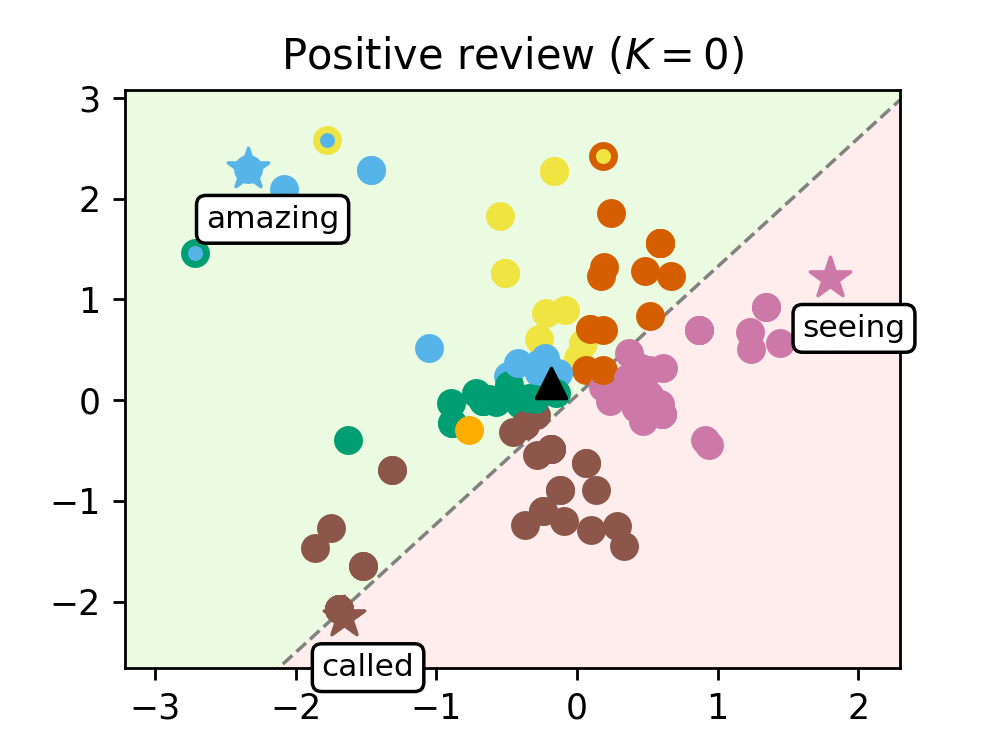
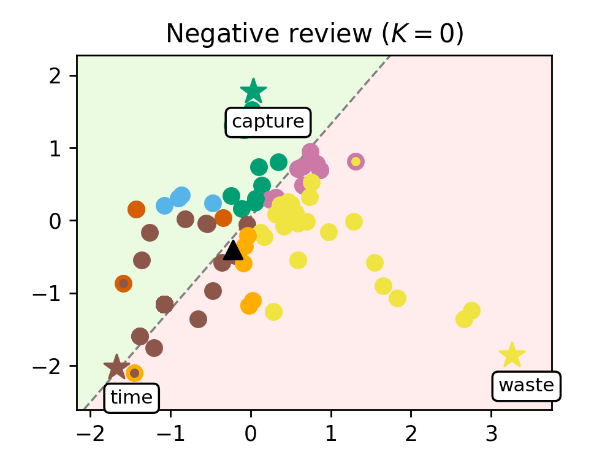

<!-- Title -->
<h1 align="center">
  Clustering in Pure-Attention Hardmax Transformers and its Role in Sentiment Analysis
</h1>

<p align="center">
  <a href="https://epubs.siam.org/doi/abs/10.1137/24M167086X">
  </a>
</p>

`Python` code for the paper 
**Clustering in Pure-Attention Hardmax Transformers and its Role in Sentiment Analysis** by Albert Alcalde, Giovanni Fantuzzi, and Enrique Zuazua. 


<p align="center">
  &nbsp;&nbsp;&nbsp;&nbsp;&nbsp;&nbsp;&nbsp;
  
</p>

## Structure of the repository
**Main files:** The two main files are:
* `imdb_classifier.ipynb`, where we conduct the numerical experiments for the sentiment analysis of IMDb movie reviews.
We read and batch the preprocessed data, define the hyperparameters, train the model and plot the tokens of reviews evolving through the layers of the transformer.  
* `dynamics.ipynb`, where we simulate the dynamics of our transformer by trying different initial configurations. Used to generate Figure 2. 

**data folder:** contains the original reviews from the IMDb dataset (`IMDB Dataset.csv`), and the preprocessed reviews (`imdb_preprocessed.csv`), which are generated with `preprocess.py`. 

**plots folder:** contains the plots generated by the different files of the repository.

**saved folder:** contains the weights and parameters of the trained models, as well as the history of the training curves (loss and accuracy).

**utils folder:** contains the definition of the functions needed in the main files:
* `graphics.py`, includes the functions needed for plotting the results.
* `models.py`, includes the definition of our transformer-based classifier, the encoder, hardmax dynamics and decoder.
* `training.py`, includes the functions needed for the training process.

## Citation

```bibtex
@article{alcalde2025clustering,
  title={Clustering in pure-attention hardmax transformers and its role in sentiment analysis},
  author={Alcalde, Albert and Fantuzzi, Giovanni and Zuazua, Enrique},
  journal={SIAM Journal on Mathematics of Data Science},
  volume={7},
  number={3},
  pages={1367--1393},
  year={2025},
  publisher={SIAM}
}
```

## Funding & Acknowledgments
Funded by the European Union’s Horizon Europe MSCA project [ModConFlex](https://modconflex.uni-wuppertal.de/en/) (grant number 101073558).

 

